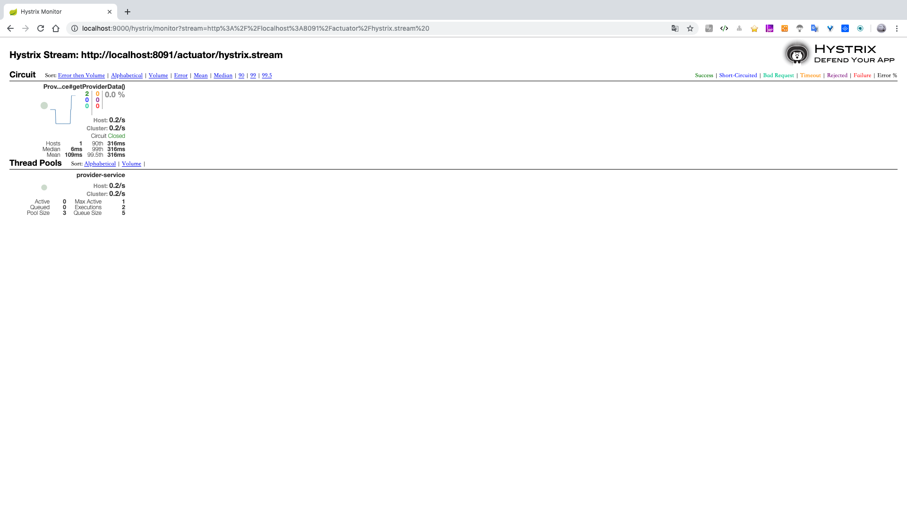

Spring Cloud Hystrix
----
Hystrix是由Netflix开源的一个针对分布式系统容错处理的开源组件。2011-2012年相继诞生和成熟，Netflix公司很多项目都使用了它，
Hystrix单词意为"豪猪"，浑身有刺来保护自己，Hystrix库技术这样一个用来行位应用程序健康的利器。

# 1. 概述
Hystrix官方代码托管在 [https://github.com/Netflix/Hystrix](https://github.com/Netflix/Hystrix)  
[Hystrix/wiki](https://github.com/Netflix/Hystrix/wiki)

## 解决什么问题
* 如下图，当用户发起一个请求服务，这个请求服务需要分别请求A、P、H、I四个服务获取数据时，平时正常流量情况下，系统稳定运行。


* 当公司某天进行促销，效果比较好，使得流量超过平时好几倍的涌入，对其中服务I并发超过 50+ 这是对服务I出现一定程度的影响，主键导致CPU、内存占用过高等问题，结果导致服务I延迟，响应过慢


* 随着压力持续增加，服务I承受不住压力或发生其他内部错误导致机器内部资源耗尽，请求推挤等情况使服务I彻底宕机不可用，更糟糕的情况是其他服务I有依赖，导致其他服务也同样出现请求堆积、资源占用等问题，这是导致整个系统出现大面的延迟或瘫痪，知道这个系统不可用


总结：在这种多系统和微服务的情况下，需要一种机制来处理延迟和故障，并保护整个系统处于可用稳定的状态，此时就需要Hystrix进行处理了。

## 设计目标
* 通过第三方客户端库对延迟和故障进行保护和控制
* 在一个复杂的分布式系统中停止级联故障。
* 快速失败并迅速恢复。
* 在可能的情况下，后退并优雅地降级。
* 实现近实时监控，警报和操作控制。

Hystrix底层使用了大量的`Rxjava`，关于Rxjava可以查看这篇博客 [https://juejin.im/post/5b17560e6fb9a01e2862246f](https://juejin.im/post/5b17560e6fb9a01e2862246f),
在理解之前最好再看下`观察者模式`。


# 2。 Spring Cloud Hystrix实战运用

## 小示例
* pom中引入依赖：
```xml
<dependency>
    <groupId>org.springframework.cloud</groupId>
    <artifactId>spring-cloud-starter-netflix-hystrix</artifactId>
</dependency>
```

* 启用短路器模式，在启动类上添加注解：`@EnableHystrix`，在服务类处添加` @HystrixCommand`注解，对熔断做处理

* 测试，请求 
正常请求：http://localhost:8081/getUser?username=spring
异常的请求： http://localhost:8081/getUser?username=hello

## Feign中使用断路器
在Feign中，默认是自带Hystrix的功能，在很老的版本中默认是打开的，在最近的几个版本中开始默认关闭了，可以通过配置文件打开这个功能。

* 修改原有项目 [feign-consumer](../demo/feign/multiparameter/feign-consumer), 引入Hystrix依赖，配置文件中添加：
```yaml
feign:
  hystrix:
    enabled: true
```

* 启动类上添加注解`@EnableHystrix`，服务层添加如下接口，并在注解中添加降级fallback类
```java
@FeignClient(name = "feign-provider", fallback = UserServiceFallback.class)
public interface IUserService {

    @RequestMapping(value = "/user/getUser",method = RequestMethod.GET)
    String getUser(@RequestParam("username") String username);

}
```

* 降级fallback类定义如下：
```java
@Component
public class UserServiceFallback implements IUserService{
	/**
	  * 出错则调用该方法返回友好错误
	  * @param username username
	  * @return String
	  */
	public String getUser(String username){
		return "The user does not exist in this system, please confirm username";
	}
}
```

* 控制层添加接口服务：
```java
@RestController
public class TestController {
    @Autowired
    private IUserService userService;

    @RequestMapping(value = "/getUser",method = RequestMethod.GET)
    public String getUser(@RequestParam("username") String username) throws Exception{
        return userService.getUser(username);
    }
}
```

* 测试
当配置文件中 `feign.hystrix.enabled=false`
postman中get请求 http://localhost:8011/getUser?username=hell
会返回如下信息,且后台有异常抛出：
```json
{
    "timestamp": 1562517642811,
    "status": 500,
    "error": "Internal Server Error",
    "message": "Request processing failed; nested exception is feign.FeignException: status 500 reading IUserService#getUser(String); content:\n{\"timestamp\":\"2019-07-07T16:40:42.761+0000\",\"status\":500,\"error\":\"Internal Server Error\",\"message\":\"Request processing failed; nested exception is java.lang.Exception\",\"path\":\"/user/getUser\"}",
    "path": "/getUser"
}
```

修改配置文件 `feign.hystrix.enabled=true`，再次再postman中get请求 http://localhost:8011/getUser?username=hell

## Hystrix Dashboard
Hystrix Dashboard 仪表盘是根据系统一段时间内发生的请求情况来展示的可视化面板，这些信息时每个HystrixCommand执行过程中的信息，
这些信息时一个指标集合和具体的系统运行情况。

项目工程入下：

名称 | 端口 | 描述
:---- | :----: | :----
erueka-server | 8761 | 注册中心
provider-service | 8081 |
hello-server | 8091
hystrix-dashboard | 9000
turbine-dashboard | 9088


Hystrix的指标需要端口的支持，因此增加actuator依赖，并公开`hystrix.stream`端口，
```xml
<dependency>
    <groupId>org.springframework.boot</groupId>
    <artifactId>spring-boot-starter-actuator</artifactId>
</dependency>
```

在hystrix-dashboard 项目中添加依赖
```xml
 <dependency>
    <groupId>org.springframework.cloud</groupId>
    <artifactId>spring-cloud-starter-netflix-hystrix-dashboard</artifactId>
</dependency>
```


运行和测试
* 启动注册中心： erueka-server
* 启动：provider-service 
* 启动：hello-server 
* 启动：hystrix-dashboard 
* 浏览器访问： http://localhost:9000/hystrix，成功运行后界面如下


在界面上写的有三个地址
* 默认集群监控: http://turbine-hostname:port/turbine.stream 
* 指定的集群: http://turbine-hostname:port/turbine.stream?cluster=\[clusterName] 
* 单个应用: http://hystrix-app:port/hystrix.stream 

这里对 hello-server 监控，在页面的输入框中填入： http://localhost:8091/actuator/hystrix.stream ，
此时看到页面数据处于 `Loading…`，不要紧张，我们请求接口：http://localhost:8091/getProviderData，会看到




### Hystrix Dashboard监控图页面
**圆圈**： 代表流量的大小和流量的健康，有绿色、黄色、橙色、红色几种颜色，通过这些颜色的表示，可以快速发现故障、具体的实例、请求压力等。

**曲线**： 代表2分钟内的流量变化，可以根据它发现流程的浮动趋势。

圆圈右边的数字的说明，这些在右上角有说明，对应颜色的指标就是数值的对应说明  
* 数字分别表示了请求的成功，熔断数，错误的请求，超时的请求，线程池拒绝次数，失败的请求和最近10秒内的错误的比率，

* Host & Cluser: 代表了机器和集群的请求频率
* Circuit：断路器状态，open/closed
* Host & Median & Mean : 集群下的报告、百分位延迟数
* Thread Pools： 线程池的指标，核心线程池指标，队列大小等

## Turbine 聚合 Hystrix
上面是单个实例的Hystrix Dashboard，但在整个系统和集群的情况下不是特别有用，所以需要一种方式来聚合集群下的监控状况，
Turbine就是来聚合所有相关hysrix.stream流的方案，然后在Hystrix DashBoard中显示。

引入依赖
```xml
 <dependency>
    <groupId>org.springframework.cloud</groupId>
    <artifactId>spring-cloud-starter-netflix-turbine</artifactId>
</dependency>
```

配置文件中配置
```yaml
turbine:
  appConfig: hello-service,provider-service
  clusterNameExpression: "'default'"
```

启动主类上添加注解：
```
@SpringBootApplication
@EnableDiscoveryClient
@EnableTurbine
@EnableHystrixDashboard
```

* 分别启动： erueka-server、hello-server、provider-service、turbine-dashboard，
* 访问：http://localhost:9088/hystrix，
* 输入第一种模式：http://localhost:9088/turbine.stream，
* 分别请求：http://localhost:8091/getProviderData、http://localhost:8081/getHelloService

可以在页面看到如下页面，可以看到多个服务的监控状态


## Hystrix异常机制和处理
Hystrix的异常处理中，有5中出错的情况下会被fallback所截获，从而触发fallback，这些情况是：
* FAILURE：              执行失败，抛出异常
* TIMEOUT:              执行超时
* SHORT_CIRCUITED:      断路器打开
* THREAD_POOL_REJECTED: 线程池拒绝
* SEMAPHORE_REJECTED:   信号量拒绝

有一中类型的异常是不会触发fallback，且不会被计数进入熔断的，它是`BAD_REQUEST`，会抛出HystrixBadRequestException，
这种异常一般对应的是由非法参数或者一些非系统异常引起的，对于这类异常可以根据响应创建对应的异常进行异常封装或者直接处理。

在上一个项目的service/dataservice曾添加`PSFallbackBadRequestExpcetion`类抛出`HystrixBadRequestException`，看是否fallback（不会）
service/dataservice添加`PSFallbackOtherExpcetion`类抛出`Exception`，看是否fallback（会）


## Hystrix配置说明
Hystrix配置比较多，具体可以参考官方地址 [https://github.com/Netflix/Hystrix/wiki/Configuration](https://github.com/Netflix/Hystrix/wiki/Configuration)

* 隔离策略，HystrixCommandKey，如果不配置，则默认为方法名
默认值：THREAD
可能的值： THREAD, SEMAPHORE
默认属性： hystrix.command.default.execution.isolation.strategy
实例属性： hystrix.command.HystrixCommandKey.execution.isolation.strategy

* 配置 hystrixCommand 命令执行超时时间，单位：毫秒
默认值：1000
默认属性： hystrix.command.default.execution.isolation.thread.timeoutInMilliseconds
实例属性： hystrix.command.HystrixCommandKey.execution.isolation.thread.timeoutInMilliseconds

* hystrixCommand命令执行是否开启超时
默认值：true
默认属性： hystrix.command.default.execution.timeout.enabled
实例属性： hystrix.command.HystrixCommandKey.execution.timeout.enabled

* 超市时是否应终端执行操作
默认值：true
默认属性： hystrix.command.default.execution.isolation.thread.interruptOnTimeout
实例属性： hystrix.command.HystrixCommandKey.execution.isolation.thread.interruptOnTimeout

* 信号量请求数，当设置为信号量隔离策略时，设置最大允许的请求数
默认值：10
默认属性： hystrix.command.default.execution.isolation.semaphore.maxConcurrentRequests
实例属性： hystrix.command.HystrixCommandKey.execution.isolation.semaphore.maxConcurrentRequests

* Circuit Breaker设置打开fallback并启动fallback逻辑的错误比率
默认值：50
默认属性： hystrix.command.default.circuitBreaker.errorThresholdPercentage
实例属性： hystrix.command.HystrixCommandKey.circuitBreaker.errorThresholdPercentage

* 强制打开断路器
默认值：false
默认属性： hystrix.command.default.circuitBreaker.forceOpen
实例属性： hystrix.command.HystrixCommandKey.circuitBreaker.forceOpen

* 当为线程隔离时，线程池核心大小
默认值：10
默认属性： hystrix.threadpool.default.coreSize
实例属性： hystrix.threadpool.HystrixThreadPoolKey.coreSize

* 当Hystrix隔离策略为线程池隔离模式时，最大线程池大小的配置，1.5.9版本还需要配置`allowMaximumSizeToDivergeFromCoreSize`为true
默认值：10
默认属性： hystrix.threadpool.default.maximumSize
实例属性： hystrix.threadpool.HystrixThreadPoolKey.maximumSize

* allowMaximumSizeToDivergeFromCoreSize属性允许配置maximumSize生效
默认值：false
默认属性： hystrix.threadpool.default.allowMaximumSizeToDivergeFromCoreSize
实例属性： hystrix.threadpool.HystrixThreadPoolKey.allowMaximumSizeToDivergeFromCoreSize

**说明** 在真实应用过程中，一把会对超时时间、线程池大小、限号量等进行修改，具体要结合业务进行分析，默认Hystrix的超时时间为1秒，通常会设置为5-10秒左右，
如果配置了Ribbon的时间，一般Ribbon的时间应短于Hystrix超时时间。

## Hystrix线程调整和计算
总的主旨是，通过自我判断和配置先发布到生产和测试，然后查看它具有体的运行情况，再调整为更符合业务的配置，通常做法是：
1. 超时时间默认为1000ms，如果业务明显超过1000ms，则根据自己的业务进行修改
2. 线程池默认为10，如果你知道确实要使用更多时可以调整
3. Canary发布，如果成功则保持
4. 在生产环境中运行超过24小时
5. 如果系统有警告和监控，那么可以依靠他们捕捉问题
6. 运行24小时候，通过延迟百分比和流量来计算有意义的最低满足值
7. 在生产或者测试环境中实时修改值，然后用仪表盘监控
8. 如果断路器产生变化和影响，则需要再次确认这个配置

这里Threadpool的大小是10，它有一个计算方法：  
每秒请求的峰值 × 99%的延迟百分比（请求的响应时间）+ 预留缓冲的值


这个例子中为：30 × 0.2 = 6 + 预留缓冲的值 = 10 ，这里预留了4个线程数。  
Thread Timeout；预留一个足够的时间的时间，250ms，然后加上重试一次的中位数值  
Connect Timeout & Read Timeout: 100ms 和 250ms，这两个值的设置方法远高于中位数的值，以适应大多数请求

## Hystrix 请求缓存
Hystrix请求缓存是Hystrix在同一个上下文请求中缓存请求结果，它是在同一个请求中进行，在进行第一次调用结束后对结果缓存，
然后接下来通参数的请求将会使用第一次的结果，缓存的生命周期是在这一次请求中有效。

HystrixCommand有两种方式，第一种是继承，第二种是直接注解。缓存也同时支持这两种。

### 1. 初始化请求上下文
前面提到，Hystrix的缓存在一次请求内是有效的，这要请求在一个Hystrix上下文中，不然在使用缓存的时候Hystrix汇报一个灭有初始化上下文的错误，
可以使用filter过滤器好Interceptro拦截器进行初始化，下面使用一个拦截器来距离，实现HandlerInterceptor,

* pom引入
[hello server pom.xml](../demo/Hystrix/hello-server/pom.xml)

* 配置文件
[hello server application.yml](../demo/Hystrix/hello-server/src/main/resources/application.yml)

* 启动类
添加注解：`@EnableHystrix`

* config
在其中的`preHand`和`afterCompletion`添加如下代码
[CacheContextInterceptor.java](../demo/Hystrix/hello-server/src/main/java/yore/config/CacheContextInterceptor.java)

### 2. 使用类来开启缓存
继承`HystrixCommand<T>`，重写它的`getCacheKey`方法，以保证对于同一个请求返回同样的键值，对于清除可以调用`HystrixRequestCache`类的`clearn`方法即可，
[HelloCommand.java](../demo/Hystrix/hello-server/src/main/java/yore/service/HelloCommand.java)

controller层代码
[CacheController.java](../demo/Hystrix/hello-server/src/main/java/yore/controller/CacheController.java)

测试，连续请求 http://localhost:8091/getUserIdByExtendCommand/1 两次，查看结果。控制台结果是否只打印一次，并且可以用Hystrix默认方法isResponsFromCache来看是否来自缓存。

### 3. 使用注解开启缓存
使用`@CacheResult` 和 `CacheRemove`即可缓存和清除缓存。

[IHelloService.java](../demo/Hystrix/hello-server/src/main/java/yore/service/IHelloService.java)
[HelloService.java](../demo/Hystrix/hello-server/src/main/java/yore/service/HelloService.java)

同样，连续请求 http://localhost:8091/getUser/1 两次


## Hystrix Request Collapser
Request Collapser 是Hystrix退出的针对多个请求调用带个后端依赖做的一种优化和节约网络开销的方法。

当发起5个请求时，在请求没有聚合和合并的情况下，是每个请求单独开启一个县城，并开启一个网络连接进行调用，这都会加重应用程序的负担和网络开销，
并占用Hystrix的线程连接池，当使用Collapser把请求都合并起来时，则只需要一个线程和一个连接的开销，这大大减少了并发和请求执行所需要的线程数和网络连接数，
尤其在一个时间段内有非常多的请求情况下能极大地提高资源利用率。


### 1. 使用注解进行合并请求
* 同缓存一样，使用拦截器实现Hystrix上下文的初始化和关闭。

* 服务层定义一个接口`ICollapsingService`
```java
public interface ICollapsingService {
	public Future<Animal> collapsing(Integer id);
	public Animal collapsingSyn(Integer id);
	public Future<Animal> collapsingGlobal(Integer id);
	
}
```

* 服务层中实现上面的接口，实现Future异步返回值的方法，其中` @HystrixProperty(name="timerDelayInMilliseconds", value = "1000")`标识合并1秒内的请求。
```java
@Component
public class CollapsingService implements ICollapsingService{
	 
	 @HystrixCollapser(batchMethod = "collapsingList", collapserProperties = {
			 @HystrixProperty(name="timerDelayInMilliseconds", value = "1000")
	    })
	public Future<Animal> collapsing(Integer id) {
		return null;
	}
	 
	 @HystrixCollapser(batchMethod = "collapsingListGlobal",scope = Scope.GLOBAL, collapserProperties = {
			 @HystrixProperty(name="timerDelayInMilliseconds", value = "10000")
	    })
	public Future<Animal> collapsingGlobal(Integer id) {
		return null;
	}
	
	@HystrixCollapser(batchMethod = "collapsingList", collapserProperties = {
			 @HystrixProperty(name="timerDelayInMilliseconds", value = "1000")
	    })
	public Animal collapsingSyn(Integer id) {
		// TODO Auto-generated method stub
		return null;
	}
	
	@HystrixCommand
	public List<Animal> collapsingList(List<Integer> animalParam) {
		System.out.println("collapsingList当前线程" + Thread.currentThread().getName());
		System.out.println("当前请求参数个数:" + animalParam.size());
		List<Animal> animalList = new ArrayList<Animal>();
        for (Integer animalNumber : animalParam) {
        	Animal animal = new Animal();
        	animal.setName("Cat - " + animalNumber);
        	animal.setSex("male");
        	animal.setAge(animalNumber);
        	animalList.add(animal);
        }
        return animalList;
	}
	
	@HystrixCommand
	public List<Animal> collapsingListGlobal(List<Integer> animalParam) {
		System.out.println("collapsingListGlobal当前线程" + Thread.currentThread().getName());
		System.out.println("当前请求参数个数:" + animalParam.size());
		List<Animal> animalList = new ArrayList<Animal>();
        for (Integer animalNumber : animalParam) {
        	Animal animal = new Animal();
        	animal.setName("Dog - " + animalNumber);
        	animal.setSex("male");
        	animal.setAge(animalNumber);
        	animalList.add(animal);
        }
        return animalList;
	}
}
```

* 编写一个接口进行测试
```
    /**
	 * 请求聚合/合并
	 * @throws ExecutionException
	 * @throws InterruptedException
	 * @return String
	 */
	@RequestMapping("/getAnimal")
	public String getAnimal() throws Exception {
	    Future<Animal> a1 = collapsingService.collapsing(1);
	    Future<Animal> a2 = collapsingService.collapsing(2);
	    System.out.println(a1.get().getName());
	    System.out.println(a2.get().getName());
	    return "Success";
	}
```

* 启动工程，访问 http://localhost:8091/getAnimal

**scomp** 属性，这个值有两个，默认(Request)、Global，如果是Global表示可以对整个应用中的请求进行合并


## Hystrix线程传递及并发策略
Hystrix会对请求进行封装，然后管理请求的调用，从而实现断路器的多种功能。Hystrix提供了两种隔离模式来记性请求的操作，一种是信号量，一种是线程隔离。

* 不太推荐的是将Hystrix隔离有默认的线程隔离，修改为信号量
```
# THREAD, SEMAPHORE
hystrix.command.default.execution.isolation.strategy=SEMAPHORE
```

* Hystrx官方推荐的一种方式为，使用`HystrixConcurrentStrategy`覆盖`wrapCallable`方法


## Hystrix命令注解
1. HystrixCommand 
封装执行的代码，然后具有故障延迟容错、断路器和统计等功能，

2. HystrixObservalbeCommand
代码：com.netflix.hystrix.HystrixObservableCommand
和上面的差不多，但主要区别就是，它是一个非阻塞的调用模式。


两者的**区别**  
* HystrixCommand默认是阻塞式的，可以提供同步和异步两种方式，但HystrixObservableCommand是非阻塞的，默认只能是异步的
* HystrixCommand的方式是run，HystrixObservableCommand执行的是construct
* HystrixCommand一个实例一次只能 发一条数据出去，HystrixObservableCommand可以发送多条数据。
 
