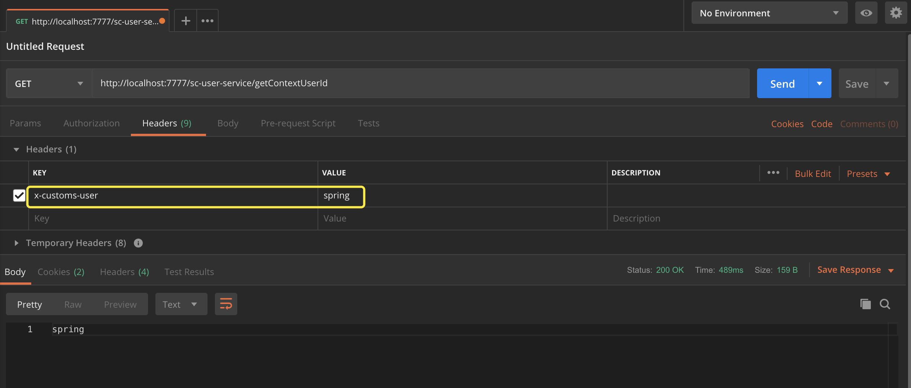

综合案例
=======
这部分会涉及前面Spring Cloud的Eureka、Ribbon、Feign、Config、Hystrix、Zuul，最终完成一个用于信息管理的小服务。

# 1 基础架构
整体架构是一个前后端分离的，前台可以是由VUE等来实现，后端使用Spring Cloud微服务架构。后端主要包括：注册中心Eureka、配置中心Config、API网关Zuul、客户端负载均衡Ribbon、断路器Hystrix。
后端整体包含两个业务服务，一个是用户服务**sc-user-service**， 一个是数据服务**sc-data-service**

从前端发起请求，根据接口获取相关的用户数据，如果用户服务有数据即刻返回，如果需要数据服务的数据，则调用数据服务的接口获取数据，组装后进行返回。

技术实现的方案流程为，用户从浏览器发起请求，经过浏览器，请求到达Nginx，打开前台界面，有前台界面请求后台数据，当请求达到Nginx后，Nginx对网关层进行负载，
因为网关也需要HA，此时网关接收到请求后会根据请求路径进行动态路由，根据服务名发现是UserService中的服务，则从Ribbon中选择一台UserService实例进行条用，
由UserService返回数据，如果此时UserService需要使用第三方DataService的数据，则跟Zuul一样，选择一台DataService的实例进行调用，返回数据到前台即可渲染页面，流程结束。


## 1.1 具体实现 
### 1.1.1 项目工程介绍表
工程名 | 端口 | 描述
:---- | :----: | :----
info-management | | 父工程
sc-config-server | 9090 | 配置中心
sc-eureka-server | 8761 | 注册中心
sc-zuul-server | 7777 | API GateWay
sc-hystrix-dashboard | 9099 | hystrix dashboard & Turbine
sc-common |  | 公共基础包，方便后台服务引用
sc-user-server | 9091 | 用户服务，对用户数据的操作
sc-data-server | 8099 | 数据服务，提供基础的数据

### 1.1.2 业务接口

说明 | 接口名
:---- | :----
获取配置文件中系统默认用户： | /getDefaultUser
获取上下文用户             | /getContextUserId
获取供应商数据             | /getProviderData  

启动：eureka-server、sc-zuul-server、sc-config-server、sc-data-service、sc-user-service，

如果启动`sc-user-service`时报如下错误：
```

***************************
APPLICATION FAILED TO START
***************************

Description:

Field restTemplate in yore.service.UserService required a bean of type 'org.springframework.web.client.RestTemplate' that could not be found.


Action:

Consider defining a bean of type 'org.springframework.web.client.RestTemplate' in your configuration.
```
请在启动类中添加如下代码：
```
    @Bean
    @LoadBalanced
    public RestTemplate restTemplate() {
        return new RestTemplate();
    }
```

* 访问：[http://localhost:9091/getContextUserId](http://localhost:9091/getContextUserId)
* 访问：[http://localhost:7777/sc-user-service/getContextUserId](http://localhost:7777/sc-user-service/getContextUserId)
* 在请求头中添加：x-customs-user=spring



## 1.2 扩展
在实际项目开发中，肯定会对基础框架做封装。

### 1.2.1 公共包（对象、拦截器、工具类等）
项目的框架一般会有一些值对象、拦截器、分页对象，权限等这些基础数据，并且其他的服务都是需要这些能力的，所以会抽取出这部分对象放入公共包里，共其他服务引用。
这里的模块`sc-common`就是这类共共模块。

### 1.2.2 用户上下文对象传递
1. 在Zuul获取到用户信息，存入Header头，后台服务进入方法前，获取到header进行组装User用户对象，后台服务通过UserContextHolder获取
2. 在后台服务之间相互调用时，增加拦截器，获取当前用户然后转换成header放入请求头，被调用服务拦截器拦截后解析到Header放入上下文中，服务通过UserContextHolder获取。

### 1.2.3 Zuul的Fallback机制
当微服务应用本身发生问题后，网关层能感知到这些错误并返回友好的提示，此时需要实现`implements FallbackProvider`接口，然后定义自己需要的错误码和错误信息即可。


## 1.3 生产环境各组件参考配置
### 1.3.1 Eureka推荐配置
服务端配置
```yaml
server:
  port: 8761
spring:
  application:
    name: eureka-server
eureka:
  client:
      serviceUrl:
        defaultZone: http://cdh6:8761/eureka/,http://cdh5:8761/eureka/
  instance:
    prefer-ip-address: true #使用ip进行注册
  server :
    enable-self-preservation: false #默认是开启的，这里关闭自我保护，如果规模较大，可以考虑不关闭
    peer-eureka-nodes-update-interval-ms: 30000 #主动失效监测间隔，默认60s，可以设置短一点。

```

客户端配置
```yaml
eureka:
  client:
    serviceUrl:
      defaultZone: http://cdh6:8761/eureka/,http://cdh5:8761/eureka/
  instance:
    prefer-ip-address: true
```

### 1.3.2 Ribbon推荐配置
Ribbon的配置一般配置为全局的，也可以配置单个服务的，这里设置的是全局的。
对于是否重试，在真实的项目中发现，由于幂等性或网络不稳定等原因导致易出问题，默认都不进行重试，
如果对于一些查询比较多的服务可以开启重试，这一版根据具体项目来定义，具体的配置可以看源代码的`DefaultClientConfigImpl`

```yaml
ribbon:
  ConnectTimeout: 5000 #全局请求连接的超时时间，默认5秒
  ReadTimeout: 5000 #全局请求的超时时间，默认5秒
  MaxAutoRetries: 0 #对当前实例的重试次数
  MaxAutoRetriesNextServer: 0 #要重试的下一个服务的最大数量（不包括第一个服务）
  OkToRetryOnAllOperations: false #多所有操作请求都进行重试
```

### 1.3.3 Hystrix推荐配置
断路器的配置如下，源代码类的话可以查看 HystrixCommandProperties
```yaml
hystrix:
  command:
    default:
      excution:
        isolation:
          thread:
            timeoutInMilliseconds: 10000 #全局请求连接的超时时间默认为1秒，通常会调整这个值大小，推荐为10s，

```

### 1.3.4 Zuul推荐配置
```yaml
zuul:
  ribbonIsolationStrategy: THREAD #使用线程池隔离策略，默认Zuul使用信号量，这里改成线程池
  threadPool:
    useSeparateThreadPools: true
    threadPoolKeyPrefix: zuulgateway
  host:
    max-per-route-connection: 50 #每个路由可用的最大连接数，默认为20
    max-total-connections: 300 #目标主机的最大连接数，默认为200
    socket-timeout-millis: 5000 #如果不是以服务名路由，而是用URL来配置Zuul路由，则使用这两个设置超时时间
    connect-timeout-millis: 5000
hystrix:
  threadpool:
    default:
      coreSize: 20 #全局默认核心线程池大小，默认值为10，一般会调大一些
      maximumSize: 50 #全局默认最下线程池大小，默认值为10，同样会调大一些
      allowMaximumSizeToDivergeFromCoreSize: true #允许配置coreSize、maximumSize生效，默认为false
  command:
    default:
      excution:
        isolation:
          thread:
            timeoutInMilliseconds: 10000  #全局请求连接的超时时间，默认为1秒，

```


 

